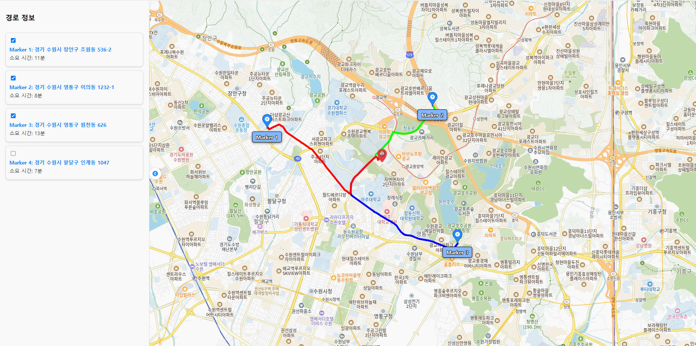

<h1 align ="center">  중간 지점 계산기 </h1>

<h2> Abstract </h2>

 
각 인원들의 위치를 입력 받아서 중간 지점을 계산한 다음, 중간 지점 주변의 스팟(음식점, 지하철역 등)을 추천해주는 프로젝트입니다. 한두명의 인원이 특출나게 멀거나, 중간 지점 계산을 제외하고 싶은 경우를 고려할 수 있도록 각각의 인원을 빼고 계산하거나, 가중치를 주어서 계산할 수 있도록 구현 되어 있습니다.  
각각의 인원에 위치를 지도에 찍고 "중간 지점 계산"을 누르면 해당 인원들의 중간 지점을 계산해줍니다. 그 다음 각각의 인원에 대한 가중치를 조정하여 원하는 중간 지점으로 맞춘 뒤, 위의 태그를 클릭하여 해당 중간 지점에서 가까운 스팟(음식점, 지하철역 등)을 추천 받을 수 있습니다. 마지막으로 이 추천 지점의 정보나, 각 인원들의 이동 경로 또한 표시할 수 있습니다.   

<h2 style = "margin-top:70px;"> Project schedule </h2>
    
| 활동            | 시작         | 종료         | 설명 |
|----------------|-------------|-------------|------|
| 프로젝트 시작   | 2024-11-13  |             |      |
| 1 주차         | 2024-11-13  | 2024-11-19  | API를 이용해 지도에서 찍은 위치의 값을 가져와서 저장하는 코드 구현 |
| 2 주차         | 2024-11-20  | 2024-11-26  | 1주차에서의 정보를 원하는 인원수 만큼 얻을 수 있도록 구현 |
| 3 주차         | 2024-11-27  | 2024-12-03  | 각 위치의 중간 위치를 구하여 저장하도록 구현 |
| 4 주차         | 2024-12-04  | 2024-12-10  | API를 이용해 중간 위치에서 가장 가까운 역을 출력하도록 구현 |
| 5 주차         | 2024-12-11  | 2024-12-16  | GUI 개선 및 최종 테스트 |
| 프로젝트 종료   | 2024-12-17  |             |      |

<h2 style = "margin-top:100px;"> Team roles & development areas </h2>

 
2020202072 김주영 : 주택 및 역 위치 데이터 수집  
2020202076 임현석 : 중간지점 계산 알고리즘 구현  
2020202022 최정현 : 메인 입력 페이지 구현  
2021202076 최유완 : 출력 페이지 구현 

<h2 style = "margin-top:100px;"> List of technologies required </h2>

 

 
Kakao MAP API 
Kakao Mobility API 

